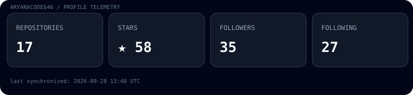

<div align="center">

# Aryan Saxena

### AI/ML · Autonomous Systems · Computer Vision · Security · Full-Stack Engineering

[](https://github.com/AryanXCode646)
[](https://www.linkedin.com/in/aryan-saxena-0213363ab/)
[](https://aryanxcode646.github.io/portfolio-2026/)
[](mailto:rockstary867@gmail.com)

<br/>

<a href="https://github.com/AryanXCode646">
  
</a>

</div>

---

## `$ whoami`

```text
Host        : aryan@archlinux
Role        : AI/ML Engineer · Systems Builder · Open-Source Contributor
Focus       : Intelligent Systems, Autonomous Software, Computer Vision & Security
Stack       : Python · C++ · TypeScript · JavaScript · Go · Kotlin
Approach    : Build → Measure → Validate → Harden → Automate
Status      : Building, experimenting, reviewing, and shipping
```

I'm **Aryan Saxena**, an AI/ML-focused engineer who enjoys working at the boundary between **machine learning and real software systems**.

I build systems where the interesting part isn't only the model or interface, but everything around it: architecture, execution, testing, security boundaries, reproducibility, observability, and failure handling.

---

## ⚡ Current Engineering Surface

<table>
<tr>
<td width="50%" valign="top">

### 🤖 AI & Autonomous Software

* LLM-powered developer systems
* Agent orchestration and tool execution
* Autonomous code-generation workflows
* Sandboxed execution and validation
* Self-correction and iterative workflows
* Local / resource-aware AI systems

</td>
<td width="50%" valign="top">

### 🎯 Reinforcement Learning

* Gymnasium environments
* PPO / SAC training pipelines
* Classical planning baselines
* Curriculum learning
* Multi-seed evaluation
* Distribution-shift experiments
* Reproducible benchmarking

</td>
</tr>
<tr>
<td width="50%" valign="top">

### 🌙 Computer Vision & Scientific Computing

* Planetary image registration
* Multi-modal image correspondence
* Illumination and scale variation
* Image-processing pipelines
* Raster workflows
* Neural image stylization

</td>
<td width="50%" valign="top">

### 🛡️ Systems, Security & Infrastructure

* Linux-first development
* Security-aware application design
* CLI and developer tooling
* Secure execution boundaries
* Automated CI/CD
* Reproducible builds

</td>
</tr>
</table>

---

## 🚀 Featured Engineering

### 🤖 [AdaptiveRL](https://github.com/AryanXCode646/ARL)

Multi-environment reinforcement-learning platform for training, evaluating, and benchmarking adaptive agents.

### 🌙 [Samanvaya](https://github.com/AryanXCode646/Samanvaya)

Research-oriented framework for multi-modal lunar image correspondence and registration across planetary imagery.

### ⚡ [Karyakshetra](https://github.com/AryanXCode646/Karyakshetra)

Developer tooling project exploring desktop code editing, project workflows, execution, and collaborative development.

### 🛡️ [OnionSec](https://github.com/AryanXCode646/OnionScan)

Security tooling for authorized Tor onion-service analysis, observation, and evidence organization.

### 🩺 [Dr.AI](https://github.com/AryanXCode646/dr-ai-clone)

Full-stack AI-assisted healthcare application prototype with modern frontend/backend architecture and security-aware workflows.

### 🎨 [Cartoonify Studio](https://github.com/AryanXCode646/cartoon-image-generator67)

Computer-vision image stylization system combining classical image processing with deep-learning pipelines.

---

## 📊 Live Profile Telemetry

<!-- PROFILE:START -->
| Metric | Current Value |
| :--- | :---: |
| **Public Repositories** | `18` |
| **Repository Stars** | `★ 56` |
| **Followers** | `31` |
| **Following** | `24` |
| **Public Gists** | `0` |
| **Latest Active Repository** | [`AryanXCode646`](https://github.com/AryanXCode646/AryanXCode646) |
| **Top Repository Languages** | `Python` (4) · `JavaScript` (2) · `TypeScript` (1) |
| **Telemetry Updated** | `2026-09-27 11:58 UTC` |
<!-- PROFILE:END -->

---

## 📈 Recent Repository Activity

<!-- ACTIVITY:START -->
| Repository | Description | Language | Stars | Last Pushed |
| :--- | :--- | :---: | :---: | :---: |
| **[AryanXCode646](https://github.com/AryanXCode646/AryanXCode646)** | — | `Python` | ★ 9 | `2026-09-27` |
| **[dr-ai-clone](https://github.com/AryanXCode646/dr-ai-clone)** | &quot;A modern, AI-powered healthcare platform built with React and TypeScript&quot; | `TypeScript` | ★ 8 | `2026-09-14` |
| **[autonomous-code-development-engine](https://github.com/AryanXCode646/autonomous-code-development-engine)** | — | `Python` | ★ 1 | `2026-08-29` |
| **[cartoon-image-generator67](https://github.com/AryanXCode646/cartoon-image-generator67)** | — | `Python` | ★ 8 | `2026-08-29` |
| **[7_days_cool_-projects](https://github.com/AryanXCode646/7_days_cool_-projects)** | — | `Python` | ★ 1 | `2026-08-29` |
| **[portfolio-2026](https://github.com/AryanXCode646/portfolio-2026)** | — | `JavaScript` | ★ 9 | `2026-08-29` |

> ⚡ Automatically synchronized from GitHub on `2026-09-27 11:58 UTC`.
<!-- ACTIVITY:END -->

---

## 🧠 Engineering Themes

```text
Autonomous AI Systems         ████████████████████
Machine Learning              ████████████████████
Reinforcement Learning        ███████████████████░
Computer Vision               ██████████████████░░
Scientific Computing          ██████████████████░░
Developer Tooling             ███████████████████░
Security Engineering          █████████████████░░░
Full-Stack Systems            █████████████████░░░
Linux / Systems               ██████████████████░░
```

These are recurring areas across my projects, not a ranking.

---

## 🧰 Technical Stack

```text
┌────────────────────┬──────────────────────────────────────────────────────────┐
│ Domain             │ Technologies                                              │
├────────────────────┼──────────────────────────────────────────────────────────┤
│ AI / ML            │ Python · PyTorch · NumPy · Pandas · OpenCV                │
│ Reinforcement      │ Gymnasium · Stable-Baselines3 · PPO · SAC                │
│ Scientific CV      │ OpenCV · Raster workflows · Image registration            │
│ Autonomous AI      │ LLMs · Agent orchestration · Tool execution               │
│ Programming        │ Python · C++ · TypeScript · JavaScript · Go · Kotlin      │
│ Web / Desktop      │ React · Node.js · Express · Electron · Tailwind CSS       │
│ Data               │ MongoDB · SQLite                                          │
│ Systems            │ Linux · Arch Linux · Shell · CLI tooling                  │
│ Infrastructure     │ Docker · GitHub Actions · Git                             │
└────────────────────┴──────────────────────────────────────────────────────────┘
```

---

## 🔬 Engineering Principles

**Reproducibility** — configurations, seeds, dependencies, and workflows should be traceable.

**Validation** — test observable behavior rather than only checking that code runs.

**Security by Design** — authentication, authorization, input validation, execution boundaries, and failure modes belong in the architecture.

**Evidence Over Assumptions** — benchmarks, tests, artifacts, and traces should support important claims.

**Automation** — repeated work becomes a script, CLI, CI job, or service.

**Maintainability** — complexity should remain explicit and understandable.

---

## 🧪 Engineering Loop

```text
Problem
   ↓
Design
   ↓
Build
   ↓
Measure
   ↓
Validate
   ↓
Harden
   ↓
Automate
   ↓
Repeat
```

---

## 🌐 Open Source

I enjoy contributing through:

`Implementation` · `Issue Investigation` · `Bug Reproduction` · `Code Review` · `Testing` · `Documentation` · `CI/CD` · `Architecture`

I value changes that are **reviewable, measurable, reproducible, and useful**.

---

## 📚 Currently Exploring

```text
Advanced RL & Policy Generalization
Agentic AI Architectures
LLM Orchestration
Reliable AI Evaluation
Scientific Computer Vision
Secure Sandboxed Execution
Systems & Backend Architecture
Developer Infrastructure
Open-Source Engineering
```

---

## 📈 GitHub Analytics

<p align="center">
  
  
</p>

<p align="center">
  
</p>

---

## 📫 Connect

<p align="center">

<a href="https://github.com/AryanXCode646">

</a>

<a href="https://www.linkedin.com/in/aryan-saxena-0213363ab/">

</a>

<a href="https://aryanxcode646.github.io/portfolio-2026/">

</a>

<a href="mailto:rockstary867@gmail.com">

</a>

</p>

---

<div align="center">

### `$ echo "Build systems that survive contact with reality."`

<sub>AI · Systems · Research · Security · Open Source</sub>

</div>
